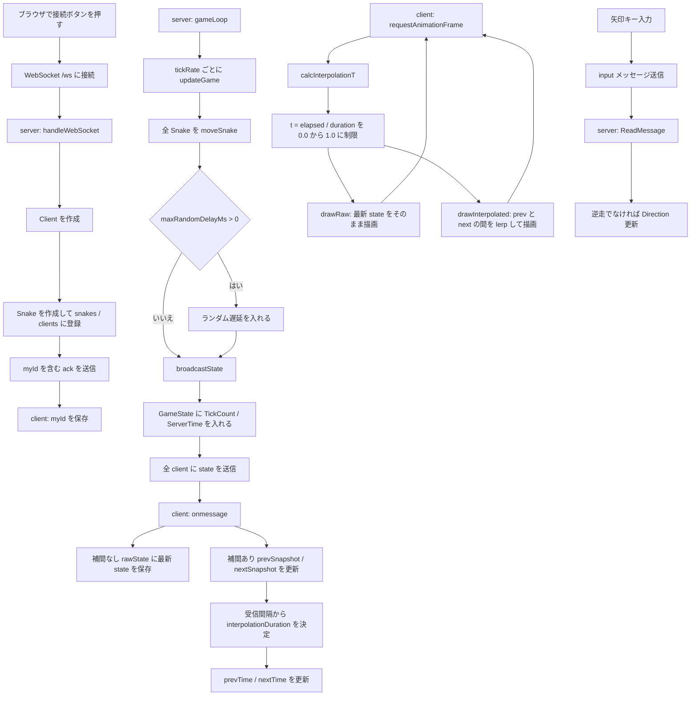

# Step 8 処理フロー図

このファイルは `step-08-interpolation` の処理フローをまとめたものです。

## WebSocket と補間描画の全体フロー



## 補間処理だけのフロー

```mermaid
flowchart TD
    A[サーバー状態 A を受信] --> B[画面上の開始位置にする]
    B --> C[サーバー状態 B を受信]
    C --> D[prevSnapshot = A]
    C --> E[nextSnapshot = B]
    D --> F[prevTime = 受信時刻]
    E --> G[nextTime = prevTime + 補間時間]
    F --> H[毎フレーム t を計算]
    G --> H
    H --> I{t < 1.0}
    I -- はい --> J[lerp(A, B, t) を描画]
    I -- いいえ --> K[B の位置で止まって待つ]
    J --> H
    K --> L[次のサーバー状態 C を待つ]
    L --> M[prevSnapshot = B / nextSnapshot = C に更新]
    M --> H
```

## 重要ポイント

- サーバーの `gameLoop()` は `tickRate` ごとに正しいゲーム状態を更新する。
- クライアントは WebSocket の受信タイミングではなく、`requestAnimationFrame` で毎フレーム描画する。
- 補間なしは、受信した最新座標をそのまま描画するためカクつきやすい。
- 補間ありは、前回座標と今回座標の間を `lerp(a, b, t)` で埋める。
- この step は補間のみで、次の状態を予測して進む外挿は実装していない。

## 視覚的な解説ページ

補間の動きだけをサーバーなしで確認したい場合は、次の HTML をブラウザで開いてください。

```text
step-08-interpolation/client/interpolation-explained.html
```
