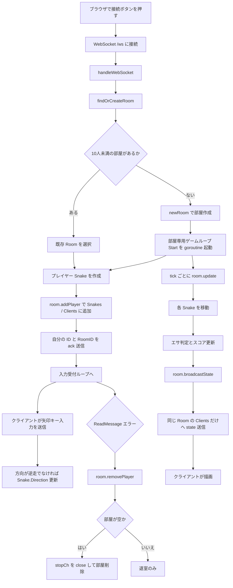

# Step 9 処理フロー図

このファイルは `step-09-rooms` の処理フローをまとめたものです。

## 10人部屋の全体フロー

## 重要ポイント

- 最大人数は `MaxPlayersPerRoom = 10`。
- `findOrCreateRoom()` が `room.PlayerCount() < MaxPlayersPerRoom` を満たす部屋を探す。
- 部屋が満室なら新しい `Room` を作成し、その部屋専用のゲームループを起動する。
- `broadcastState()` は同じ `Room` の `Clients` にだけ送信する。
- 部屋が空になると `stopCh` でゲームループを止め、`rooms` から削除する。
