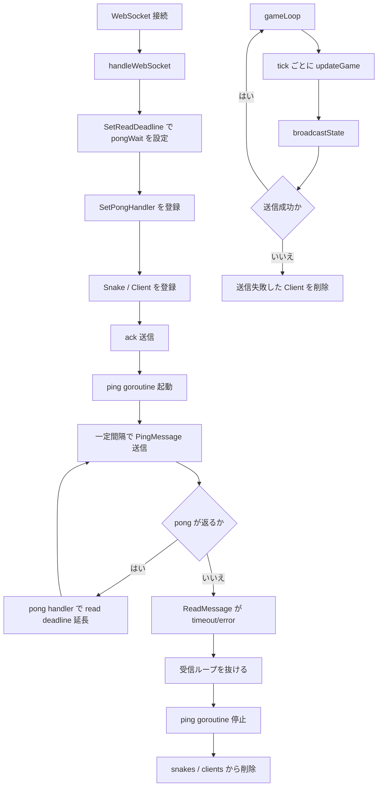
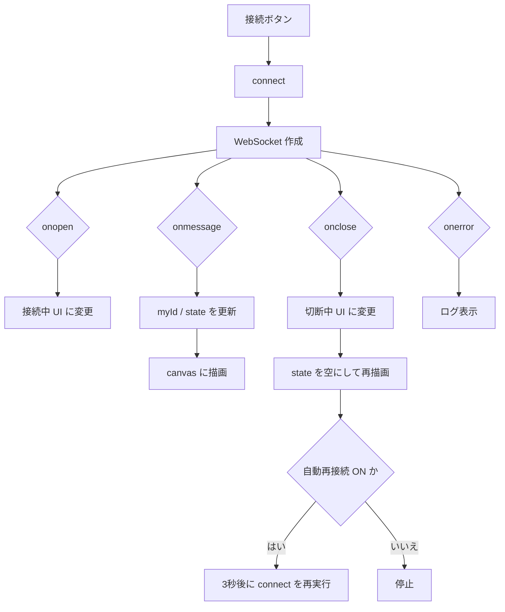

# Step 10 処理フロー図

このファイルは `step-10-reconnect` の処理フローをまとめたものです。

## サーバー側フロー

## クライアント側フロー

## 重要ポイント

- ping/pong と read deadline で無応答接続を切断扱いにする。
- `broadcastState()` の送信失敗も切断として扱い、該当プレイヤーを削除する。
- クライアントの再接続は「新しいプレイヤーとして再入場」する単純な方式。
- `Client.writeText()` で通常メッセージ送信を直列化し、ping は `WriteControl` で送る。
