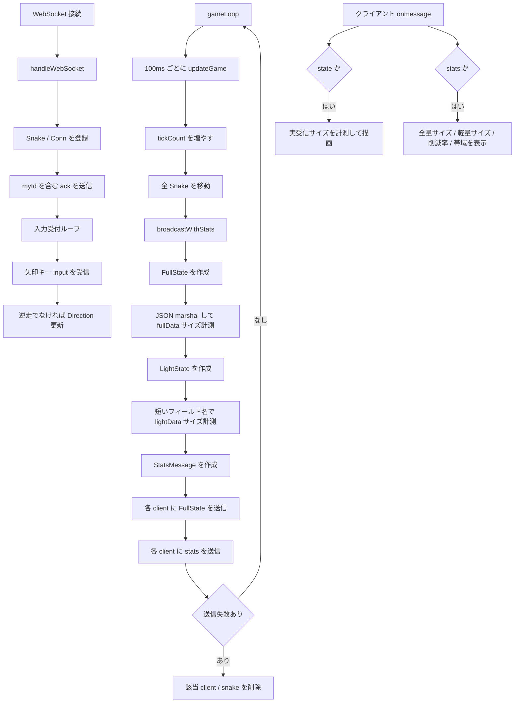

# Step 11 処理フロー図

このファイルは `step-11-optimization` の処理フローをまとめたものです。

## 最適化計測フロー

## 重要ポイント

- 実際に送っているゲーム状態は `FullState`。
- 同じ tick 内で `LightState` も作り、短い JSON フィールド名にした場合のサイズを比較する。
- `StatsMessage` を別メッセージとして送り、クライアントでサイズ・削減率・推定帯域を表示する。
- この step の主目的は、差分送信や軽量フォーマットへ進む前に「全量送信のコストを観測する」こと。
