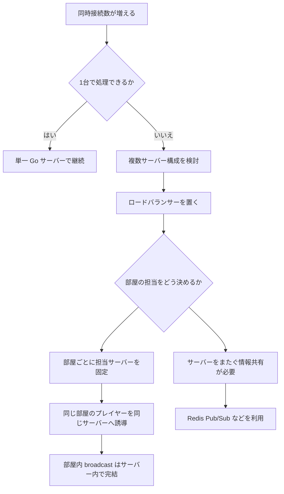
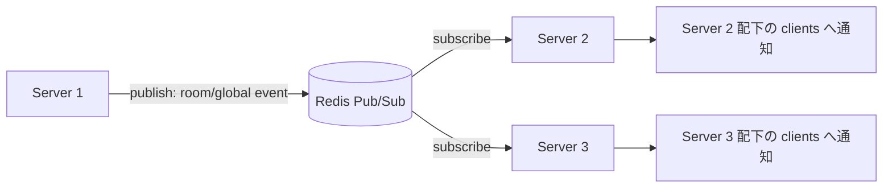
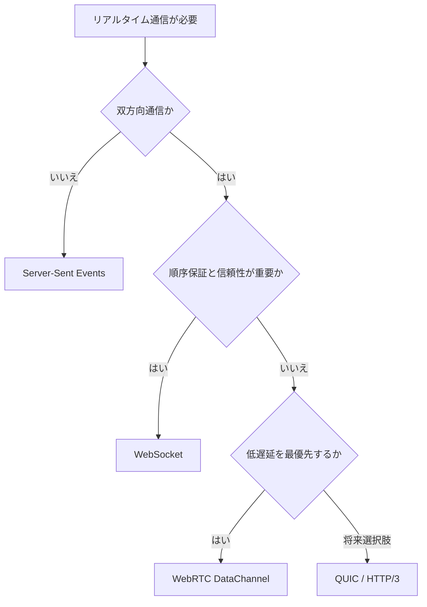

# Step 12 処理フロー図

このファイルは `step-12-advanced` の処理フローをまとめたものです。

`step-12-advanced` は実装コードではなく、1台構成を超えるための設計トピックを扱う README 中心の step です。

## 1台構成から複数サーバー構成へ

## Redis Pub/Sub の概念フロー

## 通信方式選択フロー

## 重要ポイント

- WebSocket は接続が特定サーバーに固定されるため、通常の HTTP よりスケール設計に注意が必要。
- 蛇ゲームのように部屋内だけで完結する処理は、部屋ごとに担当サーバーを固定すると設計しやすい。
- Redis Pub/Sub は、部屋をまたぐ通知・全体人数・ランキング・サーバー間イベント共有に向いている。
- WebSocket はチャットや蛇ゲームには十分だが、FPS など極端な低遅延用途では WebRTC DataChannel なども候補になる。
